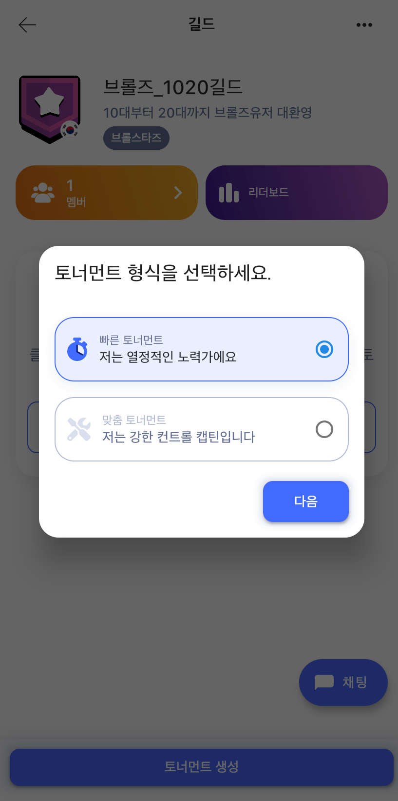
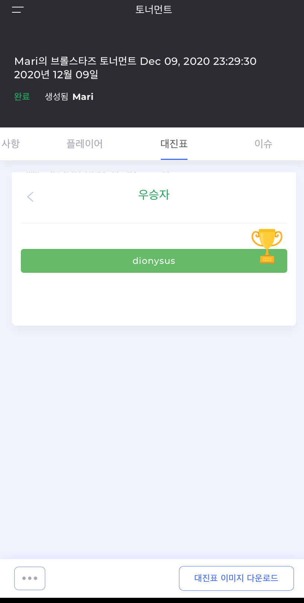

# game.tv 가이드

game.tv 이용 가이드 입니다. 

## 용어정리 - guild, 길드

game.tv 에서는 유저들이 토너먼트 만들고 참여하기 위해서 먼저 길드라는 명칭의 커뮤니티를 만들고, 길드라는 커뮤니티 단위에서 토너먼트를 진행합니다.

## 토너먼트에 참여하고 싶다면

토너먼트에 참여하고 싶은 분은 [길드](#2-길드) 를 참조하여, 토너먼트를 주최하는 길드를 찾고, 길드에 가입하신 다음, [토너먼트 참여하기](#5-토너먼트-참여하기) 를 참조하여 토너먼트에 참여하시면 됩니다.

## 토너먼트를 운영하고 싶다면

 토너먼트를 만들고 운영을 하는 방법을 알고 싶은신 분은 [길드](#2-길드) 를 참조하여, 우선 [길드를 만들고](#24-길드-만들기) 길드에 토너먼트를 진행할 사람을 충분히 모집하여, [토너먼트 생성하기](#3-토너먼트-생성하기) 및 [토너먼트 운영하기](#4-토너먼트-운영하기) 를 참조하여 토너먼트를 만들고 진행하시면 됩니다. 만약 가이드에 대해 질문이 있거나, 가이드를 통해 토너먼트를 만들고, 참여하는 데 어려움을 겪으신다면, [이슈만들기](https://github.com/mari1208/game-tv-guide/issues/new/choose)를 통해 내용을 남겨주시면 확인해서 가이드 업데이트에 반영하겠습니다. 문의내용들은 정리하여 수시로 [궁금해요! QnA](#6-궁금해요-QnA)에 반영하도록 하겠습니다.

# 목차

1. [회원가입](#1-회원가입)
2. [길드](#2-길드)
3. [토너먼트 생성하기](#3-토너먼트-생성하기)
4. [토너먼트 운영하기](#4-토너먼트-운영하기)
5. [토너먼트 참여하기](#5-토너먼트-참여하기)
6. [궁금해요! QnA](#6-궁금해요!-QnA)
7. [동영상가이드](#7-동영상가이드)

# 1. 회원가입

# 2. 길드

## 2.1. 길드탐색

국가별 길드를 보고 싶으면 오른쪽 상단을 클릭하세요.

### 2.2. 국가선택후 적용

한국(South Korea) 선택-적용을 클릭합니다.

### 2.3. 길드찾기

한국의 다양한 길드 중에서 자신에게 맞는 길드를 선택하세요.

하단의 **+ 버튼**을 클릭하여 나만의 길드를 만들 수 있습니다.

### 2.4. 길드 만들기

옵션항목을 채워넣고 하단의 **길드만들기**를 클릭하시면 됩니다.

### 2.5. 멤버초대하기

길드를 만들었다면 길드에 가입할 친구를 초대하세요.

[목차로](#목차)

# 3. 토너먼트 생성하기

### 3.1. 토너먼트 운영하기 버튼

 내 프로필 하단의 **토너먼트 운영하기** 버튼을 클릭합니다.

### 3.2. 게임선택

토너먼트를 진행할 게임을 선택하세요.

### 3.3. 토너먼트생성옵션

**빠른 토너먼트**는 옵션이 정해져 있어서 선택이 용이합니다.

선택하셨다면 **다음**을 클릭해 주세요.

옵션 선택 후, 하단의 **토너먼트 생성**을 클릭해 주세요.

**맞춤 토너먼트**는 옵션을 조정할 수 있습니다.

원하는 토너먼트 운영방식을 선택합니다.

세부 옵션을 지정한 후, 하단의 **활동**을 클릭합니다.

토너먼트가 생성되었습니다.

### 3.4. 초대하기

토너먼트를 생성했으니, **토너먼트 링크**를 복사해서 친구들을 초대하세요.

### 3.5. 토너먼트 수정

토너먼트 내용을 수정하려면 왼쪽 하단 버튼을 클릭하여 수정합니다.

[목차로](#목차)

# 4. 토너먼트 운영하기

내가 생성한 토너먼트를 관리하기 위해서는 내 프로필에서 **토너먼트 운영하기**를 클릭합니다.

### 4.1. 자세한 사항 탭

토너먼트의 옵션 정보를 확인하고 수정 할 수 있습니다.

### 4.2. 플레이어 탭

해당 토너먼트에 참여하고자 등록한 플레이어의 정보를 볼 수 있습니다.

### 4.3. 대진표 탭

참여팀이 많을 경우, **대진표** 탭에서 대진표를 확인 할 수 있습니다. 

### 4.4. 참여자 등록 관리

토너먼트에 참가신청하고 아이디를 등록한 플레이어들을 확인할 수 있습니다.

### 4.5. 경기결과 관리

경기결과를 확인할 수 있습니다.

최종 우승자를 결정해야 할 경우 선택할 수 있습니다.

[목차로](#목차)

# 5. 토너먼트 참여하기

토너먼트 참여하기에는 3가지 방법이 있습니다.

### 5.1. 길드찾기로 참여하기

원하는 길드를 클릭하여 해당 길드에서 주최하는 토너먼트에 참여합니다.

### 5.2. 내 프로필에서 참여하기

내 프로필에 있는 **토너먼트 참여하기** 버튼을 클릭하여 참여할 수 있습니다. 

내가 운영하는 토너먼트가 있을 경우 **길드와 커뮤니티** 를 클릭하여 **길드찾기**로 참여하실 수 있습니다.

### 5.3. 초대링크로 참여하기

토너먼트 참여링크를 받았다면 해당링크를 클릭해서 참여할 수 있습니다.

### 5.4. 게임ID 등록하기

토너먼트에 참가 할 해당 게임 내 ID를 등록합니다.

게임 ID를 기입하고 **참여하기**를 클릭하세요.

3vs3 같은 다vs다 게임에선 개인인지 팀인지 참여형식도 기입 해야 합니다.

### 5.5. 게임 내 ID 찾는 방법

등록페이지에서 확인하실 수 있습니다.

### 5.6. 토너먼트 참여정보 확인

내가 참여한 토너먼트 페이지에서 채팅은 물론 토너먼트 정보 및 매치 정보를 확인 할 수 있습니다.

탭을 클릭해서 원하는 정보를 확인하세요.

### 5.7. 토너먼트 대기

토너먼트 시작 전에 참여한 페이지로 오면 페이지 내에서 알림 메시지를 확인할 수 있습니다. 

페이지 상단에 토너먼트 시작 시간까지 남은 시간을 확인할 수 있습니다.

페이지 하단에 **플레이(혹은 준비중)** 버튼을 볼 수 있습니다. 시작 시간 전까지는 활성화되지 않습니다.  

**토너먼트 시작전엔 플레이하던 게임은 종료를 하고 대기합니다. 그래야 플레이 버튼을 클릭했을 때 자동 게임접속이 가능합니다.**

토너먼트 시간이되면 **플레이** 버튼이 활성화 됩니다.

**참여자 회선이 모두 동일하지 않기 때문에 2~3분의 딜레이가 생길 수도 있습니다.**

**플레이** 버튼을 클릭해서 게임에 참여합니다.

### 5.8. 게임플레이

플레이 버튼을 누르면 바로 게임이 로딩되며 게임화면으로 이동합니다. 

친선게임으로 접속되었습니다. 인원에 맞게 슬롯을 잠그고 플레이를 합니다.

### 5.9. 경기결과

정해진 경기를 모두 완수하셨으면 게임을 종료합니다.

게임을 종료하고 참여페이지로 돌아오면 경기결과를 확인할 수 있습니다.

[목차로](#목차)

# 6. 궁금해요! QnA
## 1. 내가 만든 토너먼트가 리스트에 안 보여요.

길드관리자가 토너먼트 생성을 할 때 **길드만** 를 체크해야 길드페이지 토너먼트 리스트에 보여집니다.

체크하지 않을 경우, 프라이빗(비공개) 토너먼트가 됩니다. 비공개 토너먼트는 링크를 복사해서 초대할 멤버들에게  전달하면 됩니다. (5.3참조)

메인 토너먼트 리스트에 보여지려면 권한을 상향조정해야 합니다.

원하는 길드관리자는 even_kr@game.tv 로 권한조정요청 메일을 보내주세요.

## 2. 경기결과가 자동으로 업데이트 되나요?

토너먼트 생성에서 **맞춤토너먼트 -  AI어시스트**  토너먼트를 선택하시면  AI에 의해 경기결과가 자동반영됩니다.

혹은, 토너먼트 생성 시, 옵션 항목에서 **AI어시스트 적용** 을 체크하시면 마찬가지로 경기결과가 자동반영됩니다. 
단, AI어시스트 적용이 체크되지 않는다면, 이는 옵션선택에서  AI어시스트가 불가한 경우일 수 있습니다.

관리자모드로 토너먼트를 적용한 경우, 경기결과를 수동으로 업데이트 해 주어야 합니다.
**토너먼트운영하기-경기 세부정보-결과입력-결과업데이트**로 경기결과를 업데이트 해야 합니다.

우승자가 결정되었습니다. 알림메시지가 전달됩니다.

## 3. 참여자 대기페이지에서 플레이버튼이 활성화되지 않아요.

AI어시스트 토너먼트인지, 관리자가 직접 관리하는 토너먼트인지 체크 하셨나요?  
AI어시스트라면 유저 환경에 의한 딜레이가 2~3분 있을 수 있습니다. 
관리자가 직접 관리하는 토너먼트라면 **관리페이지-로비-로비 생성**을 완료해야 플레이버튼이 활성화 됩니다.

**로비생성화면**

**로비가 생성되었습니다.**  
이제 잠시 후 대기페이지에서  플레이버튼이 활성화 됩니다. 혹은 관리자는 바로 게임시작하기 버튼을 눌러 강제로 플레이버튼을 활성화 시킬 수 있습니다. 

## 4. 솔로쇼다운을하면 자동으로 경기결과가 업데이트 되지 않아요.

솔로쇼다운은 1인이 한 팀이 되어 여러명이 동시에 플레이 하는 게임이라 경기결과가 승/패로 전달되지 않고 순위별 점수로 전달됩니다. 해당 점수는 **토너먼트운영하기-로비-라운드클릭-점수매기기**를 클릭해서 확인하실 수 있습니다.
여러명일 경우 자동으로 등수와 점수가 기록되어 있고, 1vs1인 경우 관리자가 참여자와 등수를 선택해 주면 점수가 적용됩니다. **점수적용-업데이트-로비끝내기**를 클릭하면 참여자 대기 페이지에 경기결과가 반영됩니다.

**여러명이 솔로쇼다운에 참여한 경우의 관리자페이지**

**업데이트가 되면 아래와 같은 화면이 보입니다.**

**당첨자 수를 정합니다.** 당첨자 수는 순위에 오르는 수를 의미합니다. 1은 1등만, 2는 2등까지, 3은 3등까지 적용되며 해당 등수에 해당하는 참여자의 대기페이지엔 **축하합니다** 메시지가 출력됩니다. 당첨자 수를 정한 **계속하기-로비끝내기**를 클릭하여 완료합니다.

**경기결과가 반영되면 알림메시지가 전달됩니다.**

## 5. 대전이 시작되어 친선방에 모이면 대전상대들이 섞여 있어요.

토너먼트 시작 직전에 대진표가 생성되고, 시작되고 나면 플레이버튼이 활성화 됩니다. 
이 버튼을 누르면 자동으로 브롤스타즈에 접속하게 되고 친선게임방에 대전상대들이 모이게 됩니다. 2vs2라면 4명이, 3Vs3이라면 6명이 한 방에 모이게 되는데, 여기선 게임형식에 따라 젬그랩, 브롤볼 등의 맵과 팀구분을 방장이 지정해 줘야 합니다.
관련 맵을 랜덤으로 지정하거나 상의해서 결정하고, 팀도 대진표에 맞게 나누고, 나머지 슬롯은 닫고 게임을 시작합니다. 

단판승이면 1판을 완료했을 때, 알림메시지가 뜹니다.

승리했다면 '축하합니다!' 메시지가 떠 있을 겁니다.

## 6. 우리팀(상대팀)멤버가 나타나질 않아요.

노쇼(no show)의 경우, 토너먼트 내에 따로 룰이 없다면, 토너먼트 생성자(호스트)에게 문의합니다. **참여자대기페이지- 채팅탭**을 눌러 호스트에 문의하시면 됩니다.  
토너먼트 생성자가 노쇼에 대한 규정을 토너먼트 내에 공지하는 것도 좋습니다.
가능하면 모두 참가해서 즐거운 게임이 될 수 있도록 해 주세요.
피치못할 사정으로 참가하지 못 할 경우, 게임시작 전에  **참여자대기페이지-오른쪽점세개-등록취소** 를 눌러서 참여를 취소해 주세요.

[목차로](#목차)

# 7. 동영상가이드

[동영상가이드 보기](#https://youtu.be/Kf_mEdW2-Ao)

