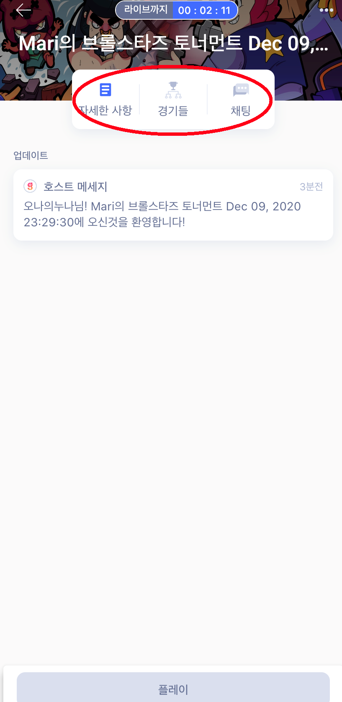

# game.tv 가이드

game.tv 이용 가이드 입니다. 토너먼트에 참여하고 싶은 분은 [회원가입](#회원가입) 과 [토너먼트참여하기](#토너먼트참여하기) 를 주로 참조하시면 되고, 토너먼트를 만들고 운영을 하는 방법을 알고 싶은신 분은 [회원가입](#회원가입), [길드생성](#길드생성), [토너먼트생성하기](#토너먼트생성하기), [토너먼트운영하기](#토너먼트운영하기) 를 참조해 주세요. 만약 가이드에 대해 질문이 있거나, 가이드를 통해 토너먼트를 만들고, 참여하는 데 어려움을 겪으신다면, [이슈만들기](https://github.com/mari1208/game-tv-guide/issues/new/choose)를 통해 내용을 남겨주시면 확인해서 가이드 업데이트에 반영하겠습니다.

# 용어정리

### guild, 길드

game.tv 에서는 유저들이 토너먼트 운영, 참여를 위해 길드라는 명칭의 커뮤니티를 만듭니다.

# 목차

1. [회원가입](#회원가입)
2. [길드](#2. 길드)
3. [토너먼트생성하기](#3. 토너먼트생성하기)
4. [토너먼트운영하기](#4. 토너먼트운영하기)
5. [토너먼트참여하기](#5. 토너먼트참여하기)

# 1. 회원가입

# 2. 길드

## 2.1. 길드탐색

국가별 길드를 보고 싶으면 오른쪽 상단을 클릭하세요.

### 2.2. 국가선택후 적용

한국(South Korea) 선택-적용을 클릭합니다.

### 2.3. 길드찾기

한국의 다양한 길드 중에서 자신에게 맞는 길드를 선택하세요.

하단의 **+ 버튼**을 클릭하여 나만의 길드를 만들 수 있습니다.

### 2.4. 길드만들기

옵션항목을 채워넣고 하단의 **길드만들기**를 클릭하시면 됩니다.

### 2.5. 멤버초대하기

길드를 만들었다면 길드에 가입할 친구를 초대하세요.

# 3. 토너먼트 생성하기

### 3.1. 토너먼트 운영하기 버튼

 내 프로필 하단의 **토너먼트 운영하기** 버튼을 클릭합니다.

### 3.2. 게임선택

토너먼트를 진행할 게임을 선택하세요.

### 3.3. 토너먼트생성옵션

**빠른 토너먼트**는 옵션이 정해져 있어서 선택이 용이합니다.

선택하셨다면 **다음**을 클릭해 주세요.

옵션 선택 후, 하단의 **토너먼트 생성**을 클릭해 주세요.

**맞춤 토너먼트**는 옵션을 조정할 수 있습니다.

원하는 토너먼트 운영방식을 선택합니다.

세부 옵션을 지정한 후, 하단의 **활동**을 클릭합니다.

토너먼트가 생성되었습니다.

### 3.4. 초대하기

토너먼트를 생성했으니, **토너먼트 링크**를 복사해서 친구들을 초대하세요.

### 3.5. 토너먼트 수정

토너먼트 내용을 수정하려면 왼쪽 하단 버튼을 클릭하여 수정합니다.

# 4. 토너먼트 운영하기

내가 생성한 토너먼트를 관리하기 위해서는 내 프로필에서 **토너먼트 운영하기**를 클릭합니다.

### 4.1. 자세한 사항 탭

토너먼트의 옵션 정보를 확인하고 수정 할 수 있습니다.

### 4.2. 플레이어 탭

해당 토너먼트에 참여하고자 등록한 플레이어의 정보를 볼 수 있습니다.

### 4.3. 대진표 탭

참여팀이 많을 경우, **대진표** 탭에서 대진표도 구성할 수 있습니다. 

### 4.4. 참여자 등록 관리

토너먼트에 참가신청한 플레이어들을 확인할 수 있습니다.

### 4.5. 경기결과 관리

경기결과를 확인할 수 있습니다.

최종 우승자를 결정해야 할 경우 선택할 수 있습니다.

# 5. 토너먼트참여하기

토너먼트 참여하기에는 3가지 방법이 있습니다.

### 5.1. 길드찾기로 참여하기

원하는 길드를 클릭하여 해당 길드에서 주최하는 토너먼트에 참여합니다.

### 5.2. 내 프로필에서 참여하기

내 프로필에 있는 **토너먼트 참여하기** 버튼을 클릭하여 참여할 수 있습니다. 

내가 운영하는 토너먼트가 있을 경우 **길드와 커뮤니티** 를 클릭하여 **길드찾기**로 참여하실 수 있습니다.

### 5.3. 초대링크로 참여하기

토너먼트 참여링크를 받았다면 해당링크를 클릭해서 참여할 수 있습니다.

### 5.4. 게임ID 등록하기

토너먼트에 참가 할 해당 게임 내 ID를 등록합니다.

게임 ID를 기입하고 **참여하기**를 클릭하세요.

3vs3 같은 다vs다 게임에선 개인인지 팀인지 참여형식도 기입 해야 합니다.

### 5.5. 게임 내 ID 찾는 방법

등록페이지에서 확인하실 수 있습니다.

### 5.6. 토너먼트 참여정보 확인

내가 참여한 토너먼트 페이지에서 채팅은 물론 토너먼트 정보 및 매치 정보를 확인 할 수 있습니다.

탭을 클릭해서 원하는 정보를 확인하세요.

### 5.7. 토너먼트 대기

토너먼트 시작 5분 전부터 참여페이지 내에서 알림 메시지를 확인할 수 있습니다. 

페이지 상단에 토너먼트 시작 시간까지 남은 시간을 확인할 수 있습니다.

토너먼트가 시작되면 **PLAY** 버튼이 활성화 됩니다.

클릭해서 게임에 참여합니다.

### 5.8. 게임플레이

플레이 버튼을 누르면 바로 게임이 로딩되며 게임화면으로 이동합니다. 

### 5.9. 경기결과

정해진 토너먼트를 모두 완수하고 참여페이지로 돌아오면 경기결과를 확인할 수 있습니다.

